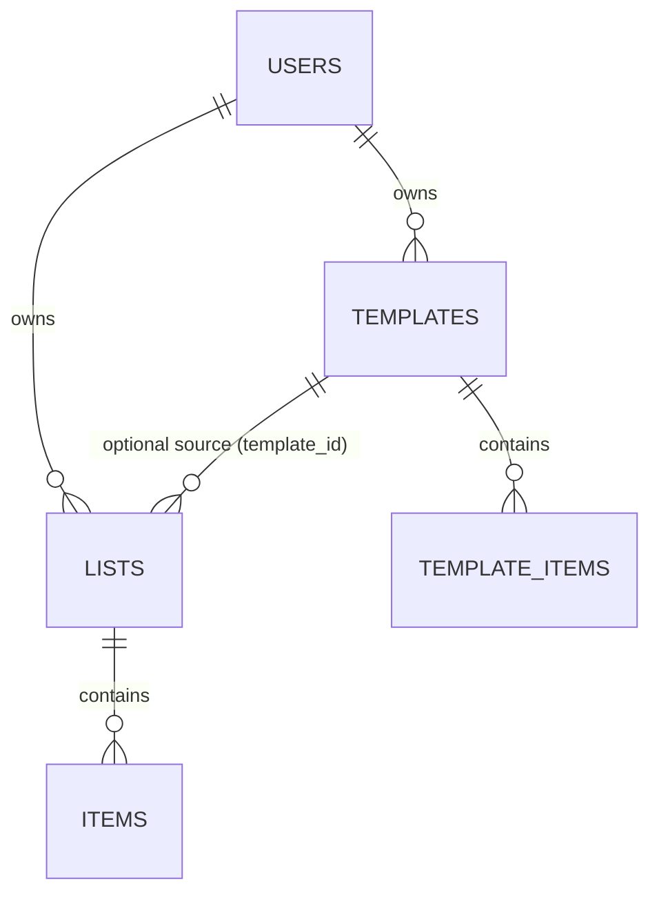

# Data Schema

This service stores data in MongoDB with five collections:

- `users`
- `lists`
- `items`
- `templates`
- `template_items`

All API responses serialize Mongo `_id` to a string field named `id`.

## Entity Relationship Diagram

Notes:

- `LISTS.template_id` is optional (`null` when a list is created manually).
- Creating a list from a template copies `TEMPLATE_ITEMS` into new `ITEMS`.

## Conventions

- Timestamps use UTC-aware datetimes (`created_at`, `updated_at`, etc.).
- Ownership is enforced with `user_id` filters on all list/item/template queries.
- Reference fields (`user_id`, `list_id`, `template_id`) are stored as strings, not `ObjectId`.
- Text validation (API layer):
  - `name`: `1..200` characters
  - `unit`: max `50` characters

## Collection: `users`

Created/updated during Google ID token auth.

Fields:

- `_id`: `ObjectId` (serialized as `id`)
- `google_sub`: `string` (unique index)
- `email`: `string | null`
- `name`: `string | null`
- `avatar_url`: `string | null`
- `created_at`: `datetime` (set on first login)
- `last_login_at`: `datetime` (updated on each login)

Indexes:

- `google_sub` unique

## Collection: `lists`

Fields:

- `_id`: `ObjectId` (serialized as `id`)
- `user_id`: `string` (owner user id)
- `name`: `string` (required)
- `template_id`: `string | null` (source template if created from one)
- `created_at`: `datetime`
- `updated_at`: `datetime`

Indexes:

- compound: `(user_id ASC, updated_at DESC)`

## Collection: `items`

Represents checklist entries inside a list.

Fields:

- `_id`: `ObjectId` (serialized as `id`)
- `user_id`: `string` (owner user id)
- `list_id`: `string` (parent list id)
- `name`: `string` (required)
- `qty`: `number | null`
- `unit`: `string | null`
- `purchased`: `bool` (default `false`)
- `purchased_at`: `datetime | null` (set when purchased)
- `sort_order`: `int` (default `0`)
- `created_at`: `datetime`
- `updated_at`: `datetime`

Indexes:

- compound: `(user_id ASC, list_id ASC)`
- compound: `(list_id ASC, sort_order ASC)`

## Collection: `templates`

Reusable shopping-list blueprints.

Fields:

- `_id`: `ObjectId` (serialized as `id`)
- `user_id`: `string` (owner user id)
- `name`: `string` (required)
- `created_at`: `datetime`
- `updated_at`: `datetime`

Indexes:

- compound: `(user_id ASC, updated_at DESC)`

## Collection: `template_items`

Line items for a template.

Fields:

- `_id`: `ObjectId` (serialized as `id`)
- `user_id`: `string` (owner user id)
- `template_id`: `string` (parent template id)
- `name`: `string` (required)
- `qty`: `number | null`
- `unit`: `string | null`
- `sort_order`: `int` (default `0`)
- `created_at`: `datetime`
- `updated_at`: `datetime`

Indexes:

- compound: `(user_id ASC, template_id ASC)`
- compound: `(template_id ASC, sort_order ASC)`

## Relationships and Lifecycle

- `users (1) -> (N) lists`
- `lists (1) -> (N) items`
- `users (1) -> (N) templates`
- `templates (1) -> (N) template_items`

Application-level cascades:

- Deleting a `list` also deletes its `items`.
- Deleting a `template` also deletes its `template_items`.
- Creating a list from a template copies all `template_items` into new `items` for the new list.
