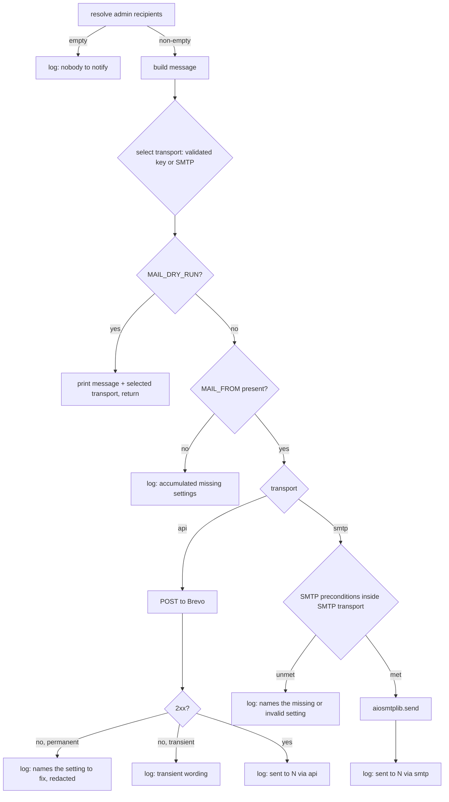

# feat: Send admin notifications via the Brevo API, with SMTP retained

## Summary

Add a second delivery transport to `app/notifications.py` — Brevo's HTTPS API — alongside the existing SMTP path, selected at send time by whether the Brevo API key is configured. SMTP stays intact so local Mailpit development and any future non-Railway host keep working unchanged.

---

## Problem Frame

Railway blocks outbound SMTP on Free, Trial and Hobby plans. This is not a credential or configuration problem and no port change avoids it — 465, 587 and 2525 are all affected. It was confirmed against Railway's outbound networking documentation and reproduced in production: the first real signup after deploy logged `SMTPConnectTimeoutError: Timed out connecting to smtp-relay.brevo.com on port 587` at `2026-09-06T08:32:22Z`. The connection never reached authentication, so the Brevo credentials have never actually been exercised.

The alternative — upgrading Railway to Pro — was considered and not taken.

The module's contract governs everything below: *email is notification, not invariant*. A first-time user's request always terminates in `403 Account pending approval`, and no failure in this module may alter that outcome.

One consequence of that contract is easy to state imprecisely, and the precise version is what this plan must hold to. The guarantee comes from the **task boundary** in `dispatch_new_user_notification`, not from the `except Exception` inside `send_new_user_notification` — that handler does not catch `BaseException`, so `CancelledError` passes straight through it and is contained only because nothing awaits the task. The property actually at risk from an HTTP transport is therefore not "does it raise" but **"does it do synchronous work on the event loop"**, because synchronous work inside the task steals time from the very request it must not affect. That is the checkable rule this plan uses.

---

## Requirements

- R1. A configured Brevo API key causes notifications to be delivered over Brevo's HTTPS API instead of SMTP.
- R2. The SMTP transport remains functional and is used whenever no API key is configured. Its *delivery* behaviour is unchanged; its *error text* changes where a shared setting moves — see Scope Boundaries.
- R3. Transport selection requires no code change and no separate "which transport" setting — presence of the key decides.
- R4. A send failure on either transport never changes the outcome of the request that triggered it, and performs no synchronous work on the event loop.
- R5. A misconfiguration is logged loudly, names the setting at fault, and reads differently from a transient delivery failure — on both transports.
- R6. A non-2xx API response is never reported as a successful send, and no intermediate state of this plan may log a success it did not perform.
- R7. `MAIL_DRY_RUN` performs no network I/O on either transport.
- R8. Recipients, message content, and the admin-query behaviour are unchanged.
- R9. The documented environment contract reflects both transports, in every place it is documented.
- R10. The API key never reaches a log record, including through an exception traceback.

---

## Scope Boundaries

- Upgrading the Railway plan to unblock SMTP instead of writing this
- Removing or replacing the SMTP transport — see the fork argued under Key Technical Decisions
- Retries, backoff, or queuing for failed sends — the module is best-effort by design and the next signup is the retry
- Brevo templates, scheduling, webhooks, delivery tracking, or attachments
- A provider-agnostic abstraction over multiple vendors' HTTP APIs
- An override that forces SMTP while the key is present
- Correcting `MAIL_FROM` in the Railway environment — a configuration change, tracked separately
- Hardening the message model against hostile input — sanitising the token-derived display name, and validating or deduplicating recipient rows. Considered during review and deliberately left out; the notification's content and recipient behaviour stay exactly as they are today
- Configuring application logging — flagged as a real gap in Open Questions, but a separate concern

### Deferred to Follow-Up Work

- Draining `_pending_sends` at shutdown: pre-existing, and entangled with the shared-client fork (see Key Technical Decisions). Worth doing, not here.
- Supply-chain controls on the production dependency set — hash pinning or an audit step in CI. U1 adds the first production dependency that carries a credential, which is the moment this becomes worth doing, but it is a CI concern with its own shape.
- Bounding the notification's abuse channel — see `docs/plans/2026-09-06-002-bound-notification-abuse-channel.md`. Making delivery work is what arms that channel, so the follow-up is worth doing soon, but it is separately scoped and separately decided.

---

## Context & Research

### Relevant Code and Patterns

- `app/notifications.py` — the whole transport change lives here. Current order inside `send_new_user_notification`: resolve recipients, build message, dry-run return, SMTP config check, TLS mode check, deliver.
- `app/notifications.py` `_tls_mode()` — the pattern to mirror: normalise a possibly-absent string setting, return the *normalised value* or `None`, let the caller own the error message, and thread the validated value into the delivery call rather than re-reading settings there. Threading matters: a selector that returns only a transport *name* forces the delivery side to re-read and re-normalise the key, putting that rule in two places.
- `app/notifications.py` `SMTP_TIMEOUT_SECONDS` — precedent that tuning knobs are module constants ("team convention #5: env is for secrets and endpoints").
- `app/config.py` — optional settings are `str | None = Field(default=None, alias="UPPER_CASE")`. Required fields would break `Settings()` at import, which runs at module scope.
- `tests/conftest.py` — `CHOPIN_LIST_FE_URL` is force-*set* because CI exported it. The new key needs the opposite treatment, force-*unset*: setting it to `""` yields `""` rather than `None` and would make every test's isolation depend on U4's empty-is-absent rule.
- `tests/conftest.py` also builds every router test's client as `httpx.AsyncClient(transport=ASGITransport(app=app))`. This is why the outbound-HTTP guard cannot simply mirror the aiosmtplib stub — see U3.
- `AGENTS.md` — one test file per module; comments capped at four lines of prose; no env defaults unless requested; tests run in a short-lived compose container.

### Institutional Learnings

`docs/solutions/` does not exist. Prior decisions for this feature live in the commit message of `5bc83ae`: why `BackgroundTasks` cannot be used, why the trigger compares two stored timestamps, and why the mail settings are optional-absent. That commit also states *"Provider-agnostic over plain SMTP; nothing in the code identifies a vendor"* — the stance this change deliberately breaks, and which must therefore be rewritten rather than left standing.

### External References

`POST https://api.brevo.com/v3/smtp/email`, authenticated with an `api-key` header carrying the raw key. Body: `sender` (object with `email`, optional `name`), `to` (list of objects with `email`), `subject`, `textContent`. Success is **201**, not 200. Errors return `{"code": ..., "message": ...}`.

The **API key and the SMTP key are different credentials**, on different tabs of the same settings page, not interchangeable. The value currently in `SMTP_PASSWORD` will not authenticate against the API.

Library facts that shape decisions below, verified against the httpx 0.28.1 / httpcore 1.0.9 / h11 0.16.0 in this repo's environment:

- `httpx` does not redact a custom `api-key` header. `SENSITIVE_HEADERS` covers `authorization` and `proxy-authorization` only, so `repr(request.headers)` prints this one in the clear where it would mask an `Authorization` header.
- On a cross-origin redirect httpx strips `Authorization` and **only** `Authorization`; a custom header is forwarded to whatever host the redirect names.
- `trust_env` defaults to `True`, so proxy environment variables silently reroute the request.
- Constructing a client calls `create_ssl_context()`, which reads and parses the CA bundle — measured at 137ms for the first client and ~10ms after, synchronously.
- A scalar `timeout=X` is **per phase**, not total; `timeout=None` disables timeouts rather than defaulting.
- h11 formats an offending header value into its `LocalProtocolError` message, so a key containing an internal control character is echoed into the exception text.

---

## Key Technical Decisions

- **HTTP client is `httpx`, promoted to production, pinned `>=0.28,<1`, with the dev entry removed**: `requests` is already present (for `google-auth`) but is synchronous with no default timeout, and would block the loop inside the task. The `<1` ceiling is deliberate — 1.0 dev builds are on PyPI with no published changelog. The dev pin of `>=0.24` must go rather than linger: a dev environment resolving 0.24 would exercise a different client than production, including different redirect and header handling.

- **Per-request `AsyncClient`, but with a module-level SSL context**: a shared client would need closing in a `lifespan` that has no shutdown side, and cannot be reused across the function-scoped event loops pytest-asyncio creates. But a naive per-request client re-parses the CA bundle on every send — synchronous work on the loop, the same hazard class used to reject `requests`, and a reviewer who knows httpx would rightly call that inconsistent. Building one SSL context as a module constant and passing it in makes construction cheap and keeps the per-request lifecycle.

- **Timeouts are per-phase and must be stated as such**: the existing SMTP constant exists so a black-holed port cannot pin the task for the better part of a minute. A scalar httpx timeout does not inherit that property, so the request needs explicit per-phase values or an outer total bound. An unbounded send is a task that never completes, never leaves `_pending_sends`, and holds a socket.

- **Client hardening is explicit, not default-inherited**: certificate verification stays on, redirects stay disabled, and `trust_env` is turned off. All three are correct by default or by omission today, and all three are one plausible edit away from leaking a credential — disabling verification is the standard reflex when a new outbound host first fails behind a proxy, and redirects would forward the `api-key` header off-origin.

- **Endpoint URL is a module constant** — the security reason is the operative one: this URL is where a credential is sent, so it must never be environment-configurable or derived from request-scoped data. The config-simplicity argument is secondary.

- **Presence of the key decides the transport, evaluated per send**: the honest argument is cost, not R3, which is this document's own requirement and cannot justify itself. An explicit `MAIL_TRANSPORT` setting would remove one real hazard — a key arriving in a shared environment group switching vendors unintentionally. It is rejected because it adds a fourth configuration state and a fifth failure mode for a two-transport system, and because the same hazard is made visible far more cheaply by naming the transport in the success log.

- **The selector returns the validated key, not a transport name**: mirroring `_tls_mode`. The key is stripped **and character-validated** in one place and threaded into the delivery call, so the whitespace and control-character rules cannot drift between selection and use.

- **The key is validated, not merely stripped**: `.strip()` handles a trailing newline from a paste. It does nothing about a control character *inside* the value, which a secret manager that wraps long lines can produce. Such a value passes httpx's encode, reaches h11, and is formatted verbatim into a `LocalProtocolError` that the blanket handler then writes to the log — a credential leak arriving through the transient-failure path, where nobody looks twice. Anything outside printable ASCII is a permanent configuration failure, logged without quoting the value.

- **The key is declared as a secret type, not a bare string**: `Settings` is a plain pydantic model, so its `repr` contains every field value. Any handler capturing frame locals, any stray `print(settings)`, any validation error surfacing the model dumps the key — and `smtp_password` today. Wrapping both removes the sharp edge that the "never log headers" rule alone does not cover.

- **The payload's recipient array is built from the validated recipient list, never parsed from the `To` header**: `EmailMessage` folds headers past ~78 characters, so with four or five admins a header-derived array contains embedded newlines and Brevo rejects the whole batch. This passes any two-admin test.

- **Subject and body are read from the same `EmailMessage` both transports use**: otherwise the two transports drift and R8 breaks quietly.

- **The payload is built as a Python object passed to the client's `json=` parameter, with literal keys**: never assembled as a string, and no dictionary from MongoDB or from token claims is ever spread into it. This is what makes header and structure injection impossible, and it is worth stating rather than relying on.

- **The payload's key set is closed**: `sender`, `to`, `subject`, `textContent`. No `replyTo`, no custom `headers`, no `tags`, no attachments. The subject stays a constant literal carrying no token-derived data. "Put the requester's name in the subject so admins can triage" and "set `replyTo` to the requester so admins can just hit reply" are the two obvious follow-ups that would hand an attacker the trusted surface of an internal email.

- **Response status is checked explicitly rather than via `raise_for_status()`**: classification needs the status and the body's `code` anyway. Non-2xx must never reach the success log — httpx returns 4xx and 5xx as ordinary responses.

- **Log the status and `code`; do not log `message` or the body**: this inverts the original rule, which had the risk backwards. Brevo's validation errors quote the offending value, so `message` is the field that carries admin email addresses; the non-JSON fallback fires on a CDN edge failure, which returns a generic page containing none. For a non-JSON body, log the status, content type and byte length — cap bytes before decoding, since httpx reads the whole body into memory. A raw body is also a route by which an intermediary can echo request metadata, including the credential, back into the log.

- **The `MAIL_FROM` check accumulates rather than returning early**: an early return would change SMTP's error output — a deployment missing both `SMTP_HOST` and `MAIL_FROM` gets one message naming both today, and would get a `MAIL_FROM`-only message afterwards, hiding the SMTP gap until the next deploy cycle. It would also break an existing test that sets `MAIL_FROM` to `None` while asserting on `SMTP_HOST` and `SMTP_TLS`.

- **Two transports, permanently — argued rather than assumed**: keeping SMTP costs two validation paths, two error vocabularies, a twelve-row state table, and a suite that must keep proving a path production does not run. Collapsing to HTTP-only, with local development served by dry-run or a small HTTP stub, would delete most of that. It is rejected because Mailpit renders an actual inbox and dry-run does not — and the unresolved `textContent`-to-HTML question in Open Questions is exactly the class of problem an inbox catches and stdout misses. Revisit once that question is settled.

---

## Open Questions

### Resolved During Planning

- *Which HTTP client, and is it a production dependency?* — `httpx`, promoted. Left dev-only it fails at import of `app.notifications` → `app.auth` → `app.main`, so the app would not boot; CI would stay green because CI installs both requirement files.
- *Where does the transport branch sit?* — selection is computed **above** the dry-run return, because dry-run must name the transport it would have used. Transport-specific validation stays inside each transport, so a stale `SMTP_TLS` cannot block a live API path structurally rather than by ordering convention.
- *One request with a recipient array, or one per admin?* — one request with an array. Fan-out would change what admins see in `To`, multiply quota use, and make "sent to N recipients" no longer a single fact. This accepts shared fate across recipients: one unusable address in the collection rejects the whole batch. That is today's behaviour on the SMTP path too, and hardening it is out of scope.
- *Is `MAIL_FROM` allowed to carry a display name?* — yes, parsed, and parsed once for both transports so a malformed value means the same thing on each.
- *Does the daily quota matter here?* — not for ordinary traffic. The request-rate ceiling is unreachable at this volume, and the 300/day account cap is only reachable under a burst of first-time sign-ins, which is tracked as separate follow-up work rather than handled here.

### Deferred to Implementation

- **Does `textContent` alone deliver a real plain-text email?** Brevo's API reference marks `htmlContent` required when no template is given; their guide says `textContent` is a valid sole body type. django-anymail, which tests against Brevo continuously, reports that a text-only request is *accepted* but Brevo converts the body to HTML and drops the `text/plain` part — silently changing the delivered email with no error. **Settle with one manual request before writing U5.** Use a throwaway key and revoke it immediately: a verification key pasted into a shell, a PR comment or a scratch file is a leaked credential. If the HTML fallback is needed, escape both the display name and the email, use a fixed template with escaped substitutions, and never place a token-derived value in an attribute or a URL — the recipients are the highest-privilege accounts in the system, so an injected link in an email they trust is a phishing primitive aimed straight at them.
- **Brevo's per-message recipient cap.** Fold into the same manual verification. Nothing in this plan caps the recipient count, so a large admin set would hit the limit as a plain 400.
- The exact `400` code and message for a malformed payload. The endpoint's reference documents no error responses. Log what comes back; do not match on it.
- Whether the reported `401 {"message":"not verified"}` is really the unverified-sender error. Community-reported only, and it shares a status and `code` with a bad key. Classify on `(status, code)` and treat every `401` as a permanent config problem.
- **Application logging is unconfigured.** There is no `basicConfig` or `dictConfig` anywhere in the repo, so records propagate to a root logger uvicorn never configures and fall to the last-resort handler at WARNING — meaning the `logger.info` success line is probably invisible in production today. This undercuts U5's verification and makes "add `basicConfig(level=DEBUG)`" the likely next move by whoever debugs the first failed send, which would also switch on httpx's own logging. Out of scope to fix here; if it is fixed, pin the `httpx`, `httpcore` and `h11` loggers to WARNING at the same time.

---

## High-Level Technical Design

> *This illustrates the intended approach and is directional guidance for review, not implementation specification. The implementing agent should treat it as context, not code to reproduce.*

Two things this pins down. Selection happens **above** dry-run, so dry-run can name the transport. Each transport's preconditions live **inside** that transport, so an SMTP setting cannot block the API path.

### Configuration state table

Non-dry-run. KEY = `BREVO_API_KEY`, FROM = `MAIL_FROM`, SMTP = host/port/tls.

| # | KEY | FROM | SMTP | Expected outcome |
|---|-----|------|------|------------------|
| S1 | absent | set | complete | SMTP send — unchanged |
| S2 | absent | set | partial | Loud; names the absent SMTP settings |
| S3 | absent | set | complete, TLS typo | Loud; names the bad value and the valid set |
| S4 | set | set | absent entirely | **API send** — the headline configuration |
| S5 | set | set | partial | API send; SMTP gaps neither checked nor logged |
| S6 | set | set | complete | API send; success log names the transport |
| S7 | set | set | complete, TLS typo | API send; the typo is unreachable |
| S8 | set | **absent** | absent | Loud; names `MAIL_FROM` |
| S9 | `""` | set | absent | Key treated as absent; SMTP path, loud about SMTP |
| S10 | `" k\n"` | set | any | Stripped, then used; never reaches a header raw |
| S11 | absent | absent | partial | Loud; names `MAIL_FROM` **and** the SMTP gaps in one message |
| S12 | key with internal control or non-ASCII character | set | any | Loud, permanent voice, naming `BREVO_API_KEY` and **never quoting the value**; no request attempted |

Dry-run overlay:

| # | State | Expected outcome |
|---|-------|------------------|
| D1 | dry-run, nothing configured | Print, no I/O — unchanged |
| D2 | dry-run + KEY | Print, **no HTTP** |
| D3 | dry-run + KEY + full SMTP | Print once, naming the transport that would have run, never the key or any prefix of it |

---

## Implementation Units

*Listed in dependency order: U1, U2, U3, U4, U5, U6. U-IDs are stable and are never renumbered, so gaps left by units removed during review stay as gaps.*

### U1. Promote the HTTP client to a production dependency

**Goal:** `httpx` is installed in the production image before any code imports it.

**Requirements:** R1, R2

**Dependencies:** None

**Files:**
- Modify: `requirements.txt`, `requirements-dev.txt`, `.dockerignore`

**Approach:**
- Add `httpx>=0.28,<1` to `requirements.txt` and **remove** the `httpx>=0.24` line from `requirements-dev.txt`. Leaving it means dev may resolve a client that behaves differently from production in exactly the areas U5 depends on.
- Add `.env` to `.dockerignore`. It is currently shipped in every build context; harmless only because the Dockerfile copies `app/` rather than `.`, which is one edit away from baking a credential into an image layer.
- Lands first and alone: a missing module is a boot failure, not a send failure, and takes sign-in with it.

**Test scenarios:**
- *Test expectation: none* — manifest change with no behavioural surface. Note this leaves the check manual: CI installs both requirement files, so nothing automated catches a production dependency left on the dev list.

**Verification:**
- An image built with `INSTALL_DEV=false` imports `app.main` successfully.

---

### U2. Add the Brevo API key setting

**Goal:** The key is readable from configuration, absent by default, and does not print itself.

**Requirements:** R1, R3, R10

**Dependencies:** U1

**Files:**
- Modify: `app/config.py`
- Test: `tests/test_config.py` *(new file — see below)*

**Approach:**
- One optional field aliased `BREVO_API_KEY`, following the existing email block's optional-absent shape.
- Declare it as a secret type rather than a bare string, and give `smtp_password` the same treatment while the file is open. A plain pydantic model's `repr` contains every field value.
- Optional-absent is mandatory: `Settings()` is instantiated at module scope, so a required field breaks every import including `tests/conftest.py`.
- Note the knock-on: U4's validation operates on the unwrapped value.

**Patterns to follow:**
- The existing SMTP block in `app/config.py`, including its four-line rationale comment.

**Test scenarios:**
- *Happy path:* a `Settings` built from a mapping containing `BREVO_API_KEY=<sentinel>` exposes that sentinel. **This is the one assertion that catches a typo in the alias** — every other test in this plan monkeypatches the settings attribute directly and bypasses environment parsing entirely. An alias typo otherwise reproduces the exact production failure this plan exists to fix, with a green suite.
- *Edge case:* with the variable absent, the field is `None` and `Settings()` constructs without error.
- *Edge case:* with the variable set to the empty string, the field is `""` and not `None` — documenting that this is the input to U4's rule, not the same thing as it.
- *Error path:* the settings object's string representation does not contain the key or the SMTP password.

**Verification:**
- The application boots with the variable absent, present, and empty.

> A new test file is correct here despite the Context section's one-file-per-module rule: `tests/test_config.py` owns `app/config.py`, which is exactly what that rule prescribes. There is no such file today only because nothing in `app/config.py` has needed one.

---

### U3. Stop ambient configuration from reaching the test suite

**Goal:** No test can take the API path, or make a real outbound call, unless it explicitly asks to.

**Requirements:** R2, R7

**Dependencies:** U2

**Files:**
- Modify: `tests/conftest.py`, `tests/test_notifications.py`, `tests/test_auth.py`, `docker-compose.override.yml`

**Approach:**
- **Remove** `BREVO_API_KEY` from the environment in `tests/conftest.py` before the app is imported. Force-*unset*, not force-set to `""` — the `CHOPIN_LIST_FE_URL` precedent sets a sentinel, and copying that shape here would make isolation depend on a rule U4 has not introduced yet.
- Pin the key absent in the `configured` fixture, and in three tests that configure settings by hand without it: `test_broken_smtp_still_yields_403_not_5xx`, `test_dry_run_writes_to_stdout_and_never_opens_smtp`, and `test_missing_smtp_config_outside_dry_run_logs_loudly_and_does_not_send`.
- **Add an autouse outbound-HTTP guard, and note carefully what it may not patch.** The plan cannot mirror the aiosmtplib stub here: that patches an attribute on `app.notifications`, and the `httpx` module object reached that way is the *same object* `conftest.py` imports its own ASGI test client from — patching `AsyncClient` there disables every router test in the repo. The guard must target the real outbound path only, at the transport layer that `ASGITransport` does not route through. Write that scoping rule down; it is the whole design of the guard.
- Provide the opt-in mechanism U5's tests use to allow a stubbed request. Every U5 scenario depends on it.
- Set `BREVO_API_KEY` empty in `docker-compose.override.yml`. Under presence-decides selection, a real key in a developer's `.env` silently bypasses Mailpit and sends live mail to real admins from a laptop; `environment:` beats `env_file:`, and neutralising environment differences is what this file already exists for. A README warning and a conftest guard cover neither `docker compose up`.

**Execution note:** Land before U4 and U5. Without it the suite can pass for the wrong reason — a bogus key produces a failure logging `"Admin notification failed"`, the exact string `test_broken_smtp_still_yields_403_not_5xx` asserts on, so it would keep passing while proving nothing about SMTP.

**Test scenarios:**
- *Edge case:* driving the HTTP client directly at a non-ASGI target inside a test raises the guard. This is self-verifying with no production code, and is the only way to prove the guard is armed before U5 exists.
- *Integration:* the existing router tests, which use an ASGI transport, are unaffected by the guard.
- *Integration:* with `BREVO_API_KEY` exported in the environment, the whole suite produces the same results as without it.

**Verification:**
- The suite behaves identically with and without an ambient key, and no test performs a real outbound request.

---

### U4. Select the transport and validate what each one needs

**Goal:** The right transport is chosen, every misconfigured state names the right setting, and no intermediate state claims a send it did not make.

**Requirements:** R1, R2, R3, R5, R6, R7, R10

**Dependencies:** U3

**Files:**
- Modify: `app/notifications.py`
- Test: `tests/test_notifications.py`

**Approach:**
- Add a selector mirroring `_tls_mode()`: normalise and **validate** the key — strip, then reject anything containing whitespace, control characters, or non-printable-ASCII — and return the validated key or `None`. Thread it into the delivery call rather than letting the delivery side re-read settings.
- An invalid key is a permanent failure naming `BREVO_API_KEY` and **never quoting the value**, not even a prefix.
- Move `MAIL_FROM` out of the SMTP-specific check into one that runs for both transports and **accumulates** rather than returning early, so a deployment missing both `MAIL_FROM` and SMTP settings still learns about both in one pass.
- Compute selection above the dry-run return so dry-run can name the transport.
- Move each transport's preconditions inside that transport.
- **The API delivery function is a stub in this unit, and the stub must log in the permanent-misconfiguration voice and must not fall through to the success line.** If it returns silently, a deploy at this commit with the key set logs `Admin notification sent to N recipient(s)` having sent nothing — a silent no-send strictly worse than the timeout it replaces.
- Pin the seam contract now — the delivery function's arguments — and assert on the arguments received, so U5 adds tests rather than rewriting these.
- Existing SMTP log wording is asserted by substring in three tests and is part of the contract. Preserve it.

**Test scenarios:**
- *Happy path (S1):* no key, complete SMTP → the SMTP layer receives the message; the API stub is not called.
- *Happy path (S4):* key set, no SMTP settings → the API stub receives the validated key, the recipient list, and the message; no SMTP error is logged.
- *Happy path (S6):* key set and SMTP complete → the API stub is called and the SMTP stub is never touched.
- *Edge case (S7):* key set with an unrecognised `SMTP_TLS` → the API path runs; the SMTP validation is never reached.
- *Edge case (S9):* key set to `""` → treated as absent; with SMTP absent the log names the SMTP gaps.
- *Edge case (S10):* key with surrounding whitespace and a trailing newline → the stub receives the stripped value.
- *Error path (S12):* key containing an internal newline → permanent-voice log naming `BREVO_API_KEY`, the key's characters absent from the whole log, and the stub not called.
- *Error path (S8):* key set, `MAIL_FROM` absent → the log names `MAIL_FROM`, does not mention SMTP, and does not contain `"Admin notification failed"`.
- *Error path (S11):* `MAIL_FROM` absent and SMTP partial → **one** message naming both.
- *Error path (S5):* key set, SMTP partial → API path; no SMTP gap is logged.
- *Error path (S2):* no key, SMTP partial → the log names the absent SMTP settings.
- *Error path (S3):* no key, SMTP complete with an unrecognised `SMTP_TLS` → the log names the offending value and the valid set.
- *Error path:* key set on the API branch → the success line `"Admin notification sent"` is **absent** from the log while delivery is a stub.
- *Happy path (D1):* dry-run with nothing configured → prints and performs no I/O, unchanged from today.
- *Error path (D2):* dry-run with the key set → prints; the HTTP guard does not fire.
- *Integration (D3):* dry-run with both configured → the output names the transport, using the same token the U5 success log uses, and contains no part of the key.
- *Regression:* `test_missing_smtp_config_outside_dry_run_logs_loudly_and_does_not_send` sets `MAIL_FROM` to `None` while asserting `SMTP_HOST` and `SMTP_TLS` appear. The accumulating check is what keeps it passing; if it is rewritten instead, that is a visible contract change and belongs in this unit's diff.

**Verification:**
- Every row of the state table produces its stated outcome, and no intermediate commit can log a success it did not perform.

---

### U5. Deliver through the Brevo API

**Goal:** A real send over HTTPS, hardened against credential leakage, with responses classified so a failure is never reported as a success.

**Requirements:** R1, R4, R6, R10

**Dependencies:** U4

**Files:**
- Modify: `app/notifications.py`
- Test: `tests/test_notifications.py`, `tests/test_auth.py`

**Approach:**
- Module constants for the endpoint URL, the per-phase timeout, and the SSL context — the last so client construction does not re-parse the CA bundle on the event loop each send.
- Construct the client with verification on, redirects disabled, and `trust_env` off. Each is a deliberate statement, not an inherited default.
- Build the payload as a Python object with literal keys, passed to the client's `json=` parameter. Recipients come from the existing admin query; subject and body come from the same `EmailMessage` the SMTP path sends; the sender comes from the shared `MAIL_FROM` parse. The key set is closed.
- Treat 2xx as success — **201, not 200**; an equality check against 200 would treat every successful send as a failure — and log the existing success line naming the transport and a recipient *count* only.
- Classify non-2xx on `(status, code)` only, never on `message`. Permanent: 401, 403, 400, 404, 406, and 402 with `not_enough_credits`. Transient: 5xx. Log status and `code`; do not log `message`, which quotes offending values and therefore carries admin addresses. For a non-JSON body log status, content type and byte length, capping bytes before decoding.
- Let timeouts and network errors reach the existing catch-all, which already produces the transient message.
- No retries.

**Patterns to follow:**
- `_deliver` as the sibling shape for a transport function; `SMTP_TIMEOUT_SECONDS` for how a tuning constant is introduced and justified.

**Test scenarios:**

*Delivery*
- *Happy path:* a 201 → the success line is logged, names the API transport, and reports a count.
- *Happy path:* a 201 whose body is empty or carries no message id → still success. Otherwise an implementer who parses the success body turns a delivered email into a logged failure.
- *Happy path:* the request body carries every admin address as a separate entry, the subject, the plain-text body, and the sender address; and the body is byte-identical to what the SMTP path sends for the same input.
- *Edge case:* five admin addresses long enough that the message's `To` header folds → every payload recipient is a clean address, and the test also asserts the header did fold, so it cannot silently stop exercising the trap.
- *Edge case:* `MAIL_FROM` as a bare address, and as `Name <addr@example.com>` → sender address bare in both, display name carried separately in the second.
- *Edge case:* a 200 rather than 201 → still success.

*Failure classification* — the discriminator is the existing contract: a transient failure logs `"Admin notification failed"` and a permanent one does not.
- *Error path:* 401 with `{"code":"unauthorized"}` → permanent voice naming `BREVO_API_KEY`; success line absent.
- *Error path:* 402 with `not_enough_credits` → permanent voice naming the daily cap.
- *Error path:* one parametrised scenario over 400, 403, 404 and 406 → permanent voice; success line absent.
- *Error path:* 503 → transient voice, naming no setting.
- *Error path:* a non-JSON error body, and an empty body → logged without raising; no body text in the record.
- *Error path:* a connect timeout → swallowed, transient voice, does not raise out of the module.
- *Error path:* **any non-2xx → the success line never appears.** The single most important assertion in the unit.

*Credential and transport hardening*
- *Integration:* the request carries the `api-key` header and a JSON content type.
- *Integration:* using a distinctive sentinel key, no log record contains it — checking `exc_text` as well as the formatted message, across the happy path, the malformed-key path and a generic-exception path. The exception path is the one that leaks, and a message-only assertion misses it.
- *Integration:* a redirect response is not followed.
- *Integration (auth path):* mirroring `test_broken_smtp_still_yields_403_not_5xx`, a broken API transport still yields a 403 rather than a 500. This is R4's headline cross-layer check and no other unit owns it.

**Verification:**
- Every response class produces exactly one log line in the right voice; no non-2xx path reaches the success line; the sentinel key appears in no record.

---

### U6. Update the documented environment contract

**Goal:** Every place that describes how mail is configured describes both transports.

**Requirements:** R9

**Dependencies:** U5

**Files:**
- Modify: `README.md`, `app/notifications.py` (module docstring), `docs/railway-live-updates.md`

**Approach:**
- `README.md`: document `BREVO_API_KEY` and the precedence rule; state that `MAIL_FROM` applies to both; correct the claim that a deployment missing the SMTP settings sends nothing; warn that a real key in a local `.env` bypasses Mailpit and mails real admins; state that the Brevo API key and SMTP key are different credentials, since that mistake produces a 401 that reads like a bad key.
- Module docstring: *"Provider-agnostic over plain SMTP"* is no longer true. Rewrite within the four-line cap.
- `docs/railway-live-updates.md`: its "Environment Contract" lists only the four original variables — stale for the six SMTP ones as well as the new key.

**Test scenarios:**
- *Test expectation: none* — documentation only.

**Verification:**
- A reader can configure either transport from the README alone.

---

## System-Wide Impact

- **Interaction graph:** the only caller is `app/auth.py`, on the first-sign-in branch; the dispatch signature is unchanged. `app/tasks.py` never imports `app.notifications` and gains neither the dependency nor the boot risk. The chain `main → auth → notifications` is what makes U1 a boot-level concern.
- **Error propagation:** unchanged in shape. Worth recording precisely: the guarantee is the task boundary, not the `except Exception`, which does not catch `BaseException`. If anyone ever awaits the task, drains it at shutdown, or calls the coroutine inline, the guarantee evaporates silently.
- **Event-loop impact:** the property at risk is synchronous work, not raised exceptions. The SSL-context constant and the byte cap before decoding an error body are both there for this reason.
- **State lifecycle risks:** `_pending_sends` is still not drained at shutdown. Delivery severity is unchanged — no retries either way — but *observability* severity is worse: HTTP flushes the whole request at once, so there is a materially wider window where Brevo has accepted the mail and the process died before reading the 201, leaving no success line. The log is least trustworthy during deploys, which is when a signup is most likely to be attributed to the deploy.
- **CI:** installs both requirement files and never builds the image, so it cannot detect a production dependency left on the dev list. The `INSTALL_DEV=false` check in U1 is manual and one-off; closing this class permanently was considered and dropped from scope.
- **Local development:** `docker compose up` is a live-send path under presence-decides selection until U3 neutralises it in the override file.
- **Integration coverage:** the mirrored auth-path test in U5 is the cross-layer scenario unit tests of this module cannot prove.
- **Unchanged invariants:** the recipient query, the message subject and body, the deep link, the dry-run contract, the 403 outcome, and the never-raises guarantee. One thing is **not** unchanged and is stated honestly rather than glossed: SMTP's error *text* changes where the `MAIL_FROM` check moves out of the SMTP-specific gate.

---

## Risks & Dependencies

| Risk | Mitigation |
|------|------------|
| `httpx` left dev-only breaks application boot, not just sending, and CI stays green | U1 lands first and alone, verified by a manual `INSTALL_DEV=false` build. Accepted residual risk: nothing prevents recurrence |
| An intermediate commit logs a successful send having sent nothing | U4's stub logs in the permanent voice and is tested for the absence of the success line |
| A non-2xx response reported as success | Explicit status check; a dedicated assertion per failure class |
| A key with an internal control character is echoed into an `h11` error and logged by the catch-all | U4 validates the character set; the log never quotes the value; U5 asserts against a sentinel including `exc_text` |
| The settings object prints its own secrets through `repr` | U2 declares the key and the SMTP password as secret types |
| A custom `api-key` header is not redacted by the client and is forwarded across redirects | Redirects disabled and asserted; no exception, request or headers object interpolated into a log record |
| Proxy environment variables silently reroute a credential-bearing request | `trust_env` off, with the reason recorded |
| Per-request client parses the CA bundle on the event loop each send | SSL context as a module constant |
| The `To`-header-folding trap passes with two admins and fails with five | Payload built from the validated list; a five-recipient test that also asserts the header folded |
| `textContent` alone may deliver HTML with no plain-text part | Open question with a manual verification step before U5 and a documented escaping fallback. Note this now lands with no sanitisation behind it, since message hardening is out of scope |
| A developer's local key makes the suite or `docker compose up` send live email | U3 unsets it in conftest and empties it in the compose override |
| An operator pastes the SMTP key into `BREVO_API_KEY` | 401 classified permanent and naming the setting; README states the credentials differ |
| The verification key from the open question leaks via shell history or a PR comment | Throwaway key, revoked immediately, never pasted into the plan or the PR |
| The `name` claim is not a verified fact and `email_verified` is never checked | Stated trust assumption, carried unchanged from today's behaviour. Mitigating it is deliberately out of scope — see Scope Boundaries |

---

## Documentation / Operational Notes

- **A new Brevo credential is required before deploy.** The API key is not the SMTP key; the value in `SMTP_PASSWORD` will not authenticate against the API.
- **Credential blast radius and rotation.** Brevo v3 API keys are account-scoped, not endpoint-scoped, so a leak plausibly reaches the contact database and account APIs, not just sending. Generate a key dedicated to this service, confirm at creation what it grants, record where it lives and how to revoke and rotate it, and treat these as rotation triggers: any suspected log exposure, the verification key immediately after use, and staff changes.
- **Retire the SMTP credential rather than leaving it dormant.** Keeping the six SMTP variables makes rollback a variable deletion, but leaves a working `SMTP_PASSWORD` in production indefinitely for a path that no longer executes — and rollback is only meaningful combined with a plan upgrade or a host change anyway. Keep them for one release, then remove and revoke.
- **`MAIL_DRY_RUN` must never be enabled in production.** It prints the whole message, recipients included, to stdout, which on Railway is the aggregated log.
- **Admin email addresses are personal data.** If a log drain to a third-party service is ever configured, everything logged here leaves the platform. This is the stated reason for the redaction rules, so they are not later optimised away as noise.
- **The error path is the hot path on day one.** `MAIL_FROM` is currently wrong in production, so the first code to run for real is the one handling untrusted third-party response text. The log-hygiene rules are not theoretical hardening here.
- `MAIL_FROM` remains required and remains wrong (`noreplay@chopinlist.dav` does not resolve). Switching transport does not change the SPF/DKIM requirement.
- The 300/day free-plan cap is account-level and unaffected by transport choice.

---

## Sources & References

- Related code: `app/notifications.py`, `app/config.py`, `app/auth.py`, `tests/test_notifications.py`, `tests/conftest.py`
- Prior decisions: commit `5bc83ae`; PR #5 (merged 2026-09-05)
- Brevo send endpoint: https://developers.brevo.com/reference/sendtransacemail
- Brevo API concepts and error codes: https://developers.brevo.com/docs/how-it-works
- Brevo SMTP vs API credentials: https://developers.brevo.com/docs/smtp-integration
- Railway outbound networking: https://docs.railway.com/networking/outbound-networking
- httpx exceptions: https://www.python-httpx.org/exceptions/
- httpx async client and pooling: https://www.python-httpx.org/async/
